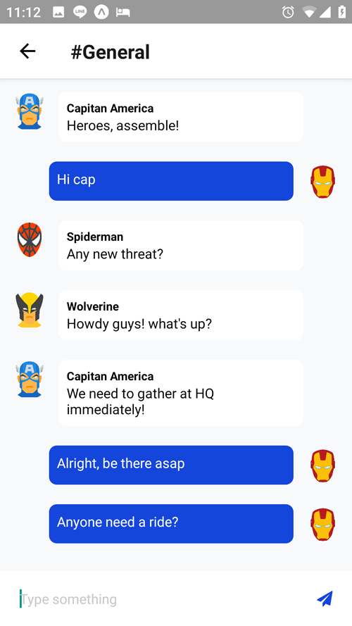

# React Native Group Chat App With CometChat PRO

This sample app shows how to build a React Native chat application using CometChat Pro SDK. 

SCREENSHOTS

Jump straight into the code or read the accompanying step-by-step guide here on our blog.

## Technology

This demo uses:

* React Native
* CometChat Pro React Native SDK

## Running the demo locally

* Download the repository or use `git clone https://github.com/cometchat-pro-tutorials/react-native-chat.git` into your local computer
* run `npm install`
* You need to sign up for CometChat PRO and create your application first
* Create an ApiKey. You can use auth-only permission for this application
* Create a Group from the dashboard
* Put your AppID, ApiKey, and Group GUID into `config.js` file
* run `expo start`
* Install Expo app on your [Android](https://play.google.com/store/apps/details?id=host.exp.exponent)/ [iOS](https://apps.apple.com/app/apple-store/id982107779) device and scan the barcode

## Useful links

* [📚Tutorial](https://prodocs.cometchat.com/docs)

## Other examples

* [ReactJS Chat app](https://github.com/cometchat-pro/javascript-reactjs-chat-app)
